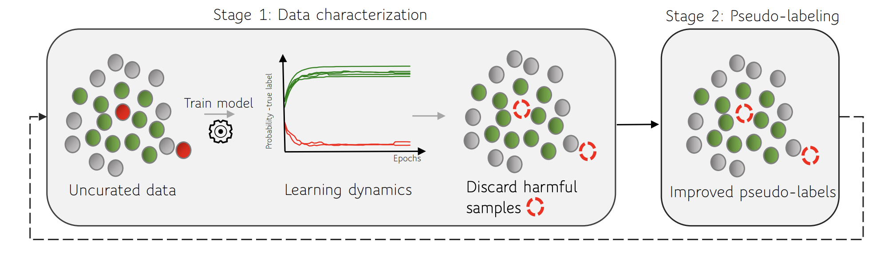

# You can’t handle the (dirty) truth: Data-centric insights improve pseudo-labeling
<!-- 
[](https://arxiv.org/abs/2406.13733)
[](https://github.com/seedatnabeel/DIPS/blob/main/LICENSE) -->



This repository contains the implementation of DIPS, a data-centric method to improve pseudo-labeling under imperfect/noisy 'labeled' data from the paper "You can’t handle the (dirty) truth: Data-centric insights improve pseudo-labeling" 

DIPS improves a variety of state-of-the-art pseudo-labeling algorithms (semi-supervised learning algorithms) via data-centric insights.

For more details, please read our [DMLR paper](https://arxiv.org/abs/2406.13733): *You can’t handle the (dirty) truth: Data-centric insights improve pseudo-labeling*.

## Installation
1. Clone the repository
2. (a) Create a new virtual environment with Python 3.10. e.g:
```shell
    virtualenv dips_env
```

2. (b) Create a new conda environment with Python 3.10. e.g:
```shell
    conda create -n dips_env python=3.10
```

3. With the venv or conda env activated, run the following command from the repository directory:

- Install the minimum requirements to run DIPS
 ```shell
pip install -r requirements.txt
 ```

4. Link the environment to the kernel:
  ```shell
 python -m ipykernel install --user --name=dips_env
 ```

## Logging
Outputs from scripts can be logged to [Weights and Biases - wandb](https://wandb.ai). An account is required and your WANDB_API_KEY and Entity need to be set in wandb.yaml file provided.


## Getting started with DIPS

To get started with DIPS one can try the tutorial.ipynb notebook in the root folder

### Scripts
To run the tabular experiments one can run the bash scripts found in the scripts folder, with results logged to wandb. For example:
```shell
 bash run_real_tabular.sh
 ```

### Notebooks
To run the notebook experiments one can run any of the Jupyter notebooks (.ipynb) found in the ``notebooks`` folder

### Computer Vision 
Details to run DIPS for Computer Vision tasks (such as FixMatch) can be found in the ``fixmatch`` folder. Requirements specific to these experiments are contained therein.

## Citing

If you use this code, please cite the associated paper:

```
@article{
dips2024,
title={You can't handle the (dirty) truth: Data-centric insights improve pseudo-labeling},
author={Nabeel Seedat and Nicolas Huynh and Fergus Imrie and Mihaela van der Schaar},
journal={Journal of Data-centric Machine Learning Research},
year={2024},
}
```

